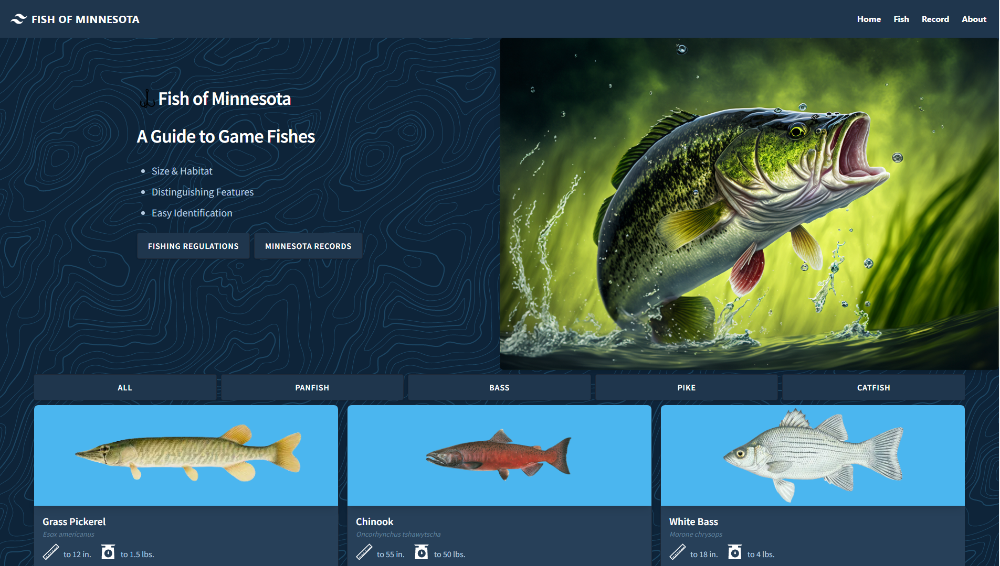

```
# Next-Fish

Next-Fish is a modern, responsive, and high-performance web application built using the latest web development technologies. This project showcases the integration of various popular libraries and tools to create a seamless user experience. The site demonstrates a visually appealing gallery of fish species, enriched with detailed information about each species. Users can easily navigate through the site, interact with images, and access relevant information about the showcased fish.



## Demo

Check out the live demo here: [https://next-mn-fish.vercel.app/](https://next-mn-fish.vercel.app/)

## Technologies Used

- [Next.js](https://nextjs.org/)
- [React](https://reactjs.org/)
- [Sanity.io](https://www.sanity.io/)
- [Portable Text](https://www.portabletext.org/)
- [Font Awesome](https://fontawesome.com/)
- [Tailwind CSS](https://tailwindcss.com/)
- [Keen Slider](https://keen-slider.io/)
- [React Medium Image Zoom](https://github.com/rpearce/react-medium-image-zoom)
- [hover.css](https://ianlunn.github.io/Hover/)
- [Sharp](https://sharp.pixelplumbing.com/)

## Project Repository

You can find the project repository on GitHub: [https://github.com/natejahnke/next-fish](https://github.com/natejahnke/next-fish)

## Getting Started

To set up the project locally, follow these steps:

1. Clone the repository:

```
git clone https://github.com/natejahnke/next-fish.git
```

2. Change to the project directory:

```
cd next-fish
```

3. Install dependencies using Yarn:

```
yarn install
```

4. Run the development server:

```
yarn dev
```

5. Open your browser and navigate to [http://localhost:3000](http://localhost:3000) to view the application.

## Building for Production

To build the application for production, run:

```
yarn build
```

After building, you can run the production server:

```
yarn start
```

## Contributing

Feel free to submit pull requests, report bugs, or suggest new features via the [GitHub issues](https://github.com/natejahnke/next-fish/issues) page.

## License

This project is open-source and available under the [MIT License](https://opensource.org/licenses/MIT).
```
